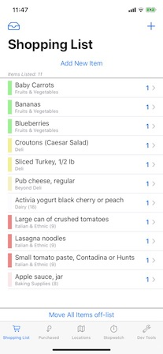
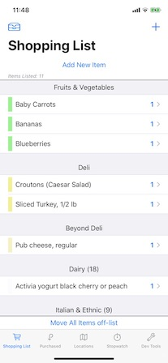
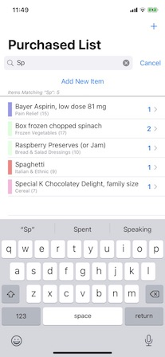
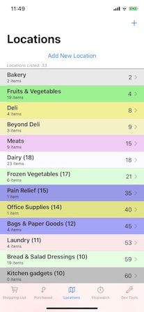

#  About "ShoppingList"

This is a simple, in-progress, "fail-in-public" iOS app development project using SwiftUI to process a shopping list that you can take to the grocery store with you, and swipe off the items as you pick them up.  It persists data in CoreData.

However, be warned: 

* the project source may change -- this is an ongoing project for me to get more familiar with certain details of SwiftUI, *although I am almost at the end of the public development cycle on this app*;  and
* there may be errors in the code, or some areas of the code might need help with regard to best practices.

Nevertheless, this project seems reasonably stable and does pretty much work as I suggest as of today (I used it just today at the grocery store and I am now starting to like it a lot).

Feel free to use this as is, to develop further,  to completely ignore, or even just to inspect and then send me a note to tell me I am doing this all wrong.  

## Last Update of Note

My Last Update of note was **August 19, 2020**, when these were some of the recent changes I made.

* Added screenshots

* (Previously) Combined the two versions of code for a shopping list view (single-section or multi-sectioned) into a single View and made the choice of which view to use an easy selection by tapping the NavigationBar's leading button.

* (Previously) Changed the use of color in the shopping list and purchased list -- no longer a background color, but just a color bar at the left of the item.  it looks a lot cleaner to my eye; but you can swap out the six or eight lines of code I added for this if you like the previous display.

* (Previously) Cleaned up shopping list and location view models (i.e., fixed a bug or two) to be sure they sent the correct notification for everything they did and never directly changed the items or locations array on their own, except in response to a notification. This fixes a problem with items not updating visually in some places.  I also made sure that newly-created ShoppingItems and Locations were saved right away.

* (Previously) Reorganized much of this README document.

## General App Structure

The main screen is a TabView, to show 
* a current shopping list, 
* a (searchable) list of previously purchased items, 
* a list of "locations" in a store, such as "Dairy," "Fruits & Vegetables," "Deli," and so forth, 
* an in-store timer, to track how long it takes you to complete shopping, and
* optionally, for purposes of demonstration, a "Dev Tools" tab to make wholesale adjustments to the data and the shopping list display (this can be hidden for real usage).

The CoreData model has only two entities named "ShoppingItem" and "Location," with every ShoppingItem having a to-one relationship to a Location (the inverse is to-many).

**ShoppingItems** have an id (UUID), a name, a quantity, a boolean "onList" that indicates whether the item is on the list for today's shopping exercise, or not on the list (and so available in the purchased list for future promotion to the shopping list), and also an "isAvailable" boolean that provides a strike-through appearance for the item when false (sometimes an item is on the list, but not available today, and I want to remember that when planning the future shopping list).    ShoppingItems currently also have a visitationOrder, that mirrors the visitationOrder of the Location to which they are assigned -- you'll see a comment in the code about why this is done.

**Locations** have an id (UUID), a name, a visitationOrder (an integer, as in, go to the dairy first, then the deli, then the canned vegetables, etc), and then values red, green, blue, opacity to define a color that is used to color every item listed in the shopping list.

* A note on color.  There is now a ColorPicker in SwiftUI (*as of WWDC2020*), and "sometime soon" I will start using that as I begin testing out XCode 12.  In the meantime, individually adjusting RGB and Alpha may not the best UI, but it will have to do.  Also, using color to distinguish different Locations may not even be a good UI, since a significant portion of users either cannot distinguish color or cannot choose visually compatible colors very well. 

For the first two tabs, swiping an item (from trailing to leading)  moves a shopping item from one list to the other list (from "on the list" to "purchased" and vice-versa).  

* This is an issue with SwiftUI, even after WWDC2020: the only swipe supported is a swipe-to-delete and it shows "Delete" in white on a red background for the action.  I like to swipe as I shop to move items off the shopping list (not delete them from Core Data), so I have co-opted the swipe to mean "move to the other list," despite the destructive "Delete  showing. This behaviour can be adjusted in code to mean "delete, really" if you prefer.  

Tapping on any item in either list lets you edit it for name, quantity, assign/edit the store location in which it is found, or even delete the item.  Long pressing on an item gives you a contextMenu to let you move items between lists,  toggle between the item being available and not available, or directly delete the item (if a swipe does not already mean "delete").

The shopping list is sorted by the visitation order of the location in which it is found (and then alphabetically within each Location).  Items in the shopping list cannot be otherwise re-ordered, although all items in the same Location have the same color as a form of grouping.  Tapping on the leading icon in the navigation bar will toggle the display from a simple, one-section list, to a multi-section list.

* Why don't you let me drag these items to reorder them, you ask?  Well, I did the reordering thing one time with .onMove(), and discovered that moving items around in a list in SwiftUI is an absolutely horrific user-experience when you have 30 or 40 items on the list -- so I don't so that anymore.  And I also don't see that you can drag between Sections of a list.
* ~~The current code offers you the choice to see the shopping list either as one big list where the coloring helps distinguish between different location (use ShoppingListTabView1 when you compile it) or a sectioned-list with GroupedListStyle (use ShoppingListTabView2, the default view).  Both seem to work fine for now; and the DevTools tab lets you flip between these on the fly.~~

The third tab shows a list of all locations, listed in visitationOrder (an integer from 1...100).  One special Location is the "Unknown Location," which serves as the default location for all new items.  I use this special location to mean that "I don't really know where this item is yet, but I'll figure it out at the store." In programming terms, this location has the highest of all visitationOrder values, so that it comes last in the list of Locations, and shopping items with an unassigned/unknown location will come at the bottom of the shopping list. 

Tapping on a Location in the list lets you edit location information, including reassigning the visitation order, as well as delete it.  You will also see a list of the ShoppingItems that are associated with this Location. A long press on a location (other than the "unknown location") will allow you to delete the location.

* Why not let the user drag the Locations around to reset the order? Well, it's partly the SwiftUI visual problem with .onMove() mentioned above.  ~~, but persisting the order the way I'd like to do (using visitationOrder markers) has a few wrinkles that seem to conflict with SwiftUI's @FetchRequest.~~
* What happens to ShoppingItems in a Location when a Location is deleted?  The items are not deleted, but simply moved to the Unknown Location.

The fourth tab is an in-store timer, with three simple button controls: "Start," "Stop," and "Reset."  This timer will be (optionally) paused when the app goes inactive (e.g., if you get a phone call while you're shopping), although the default is to not pause it when going inactive. (See Development.swift to change this behaviour.)

Finally, there is a  tab for "development-only" purposes, that allows wholesale loading of sample data, removal of all data, offloading data for later use, and changing the sectioned-display of the shopping list. It's easier to make changes and see them here, rather than hunt through the source code to make these changes (although there is plenty of commentary in the source code).

So, 

* **If you plan to use this app**, the app will start with an empty shopping list and an almost-empty location list (it will contain the sacred "Unknown Location"); from there you can create your own shopping items and locations associated with those items.  

* **If you plan to play with or just test out this app**, go straight  to the Dev Tools tab and tap the "Load Sample Data" button.  Now you can  play with the app, and eventually delete the data when you're finished.

## Comments & Things I Could Work On

* This version makes no direct use of @FetchRequest or Combine and I have *gone completely old-school*, just like I would have built this app using UIKit, before there was SwiftUI and Combine.  I post Notifications that a ShoppingItem or a Location has either been created, or edited, or is about to be deleted.  Every  view model loads its data only once from Core Data, and signs up for appropriate notifications.  From then on, it can see which shopping item or location is posting the notification and what kind of change is happening. (It never refetches data from Core Data.) The view model can then react accordingly, alerting SwiftUI.  This most recent design suits my needs.

* I am puzzled by how to handle rotation.  Rotate from a compact-width orientation into a regular-width orientation  (e.g., iPhone 11) and, yes, you get something surprising (I understand that part and think I can handle that later).  But then rotate back into a compact-width orientation and the display goes a little strange. So, for now, the app supports only Portrait orientation (project settings or info.plist).

* I'd like to look at CloudKit support for the database, but probably separately, for my own use, although this  could return to public view if I run into trouble and have to ask for help.  The general theory is that you just replace NSPersistentContainer with NSPersistentCloudkitContainer, flip a few switches in the project, add the right entitlements, and off you go. *I doubt that is truly the case*, and certainly there will be a collection of new issues that arise.

* I should invest a little time on iPadOS.  Unfortunately, my iPad 2 is stuck in iOS 9, so it's not important to me right now.  As a future option, though -- even though you probably don't want to drag an iPad around in the store with you -- you might want to use it to update the day's shopping list and then, via the cloud, have those changes show up on your phone to use in-store.

*  I still get console messages at runtime about tables laying out outside the view hierarchy, and one that's come up recently of "Trying to pop to a missing destination." (current set-up is XCode 11.5, simulator & myiPhone on iOS13.5, and MacOS 10.15.5). Since I added contextMenus, I get a plenty of "Unable to simultaneously satisfy constraints" messages.  I'm ignoring them for now, and I have already seen fewer or none of these in testing out XCode 12. Several internet comments  seem to be saying ignoring most of these messages is the right thing to do for now.

* I have thought about expanding the app and database to support multiple "Stores," each of which has "Locations," and having "ShoppingItems" being many-to-many with Locations so one item can be available in many Stores would be a nice exercise. But I have worked with Core Data several times, and I don't see that I gain anything more in the way of learning about SwiftUI by doing this, so I doubt that I'll pursue this any time soon.

* I could add a printing capability, or even a general sharing capability (e.g., email the list to someone else).  I did this in another (*UI-Kit based*) project, so it should be easy, right?  

I have, only briefly, tested out this code with **XCode 12beta 4**, and here are some observations so far:

* Core Data now automatically generates an extension of a Core Data class to be Identifiable, if the data model has an id field (mine has type UUID, but maybe other Hashable types apply as well).  So adding my own conformance of Shopping Item and Location to Identifiable is no longer needed.  However, XCode will generate a duplicate conformance error, not on my adding conformance, but *primarily on its own generated file*, which was a little confusing at first.
* GroupedListStyle now puts a section header in .uppercase by default, but you can override that by using .textcase(.none) so the header displays the title exactly as you want.
* Things otherwise look good; however, the "deletion issue" that seems to be gone in XCode 11.6 might still be there in the new XCode 12 beta 4.  i have extensive comments in the code about handling this.

At some point, however,   I will stop working on this project.
**That time is now coming very soon**.  I have learned a lot about SwiftUI  -- that was the point of the project --
and I am  certainly not at all interested in creating the next, killer 
shopping list app or moving any of this to the App Store.  *The world really does not need a new list-making app*.

##  View Updating Issues

Remember that I built this project in public only as an experiment, and to   offer some  suggested code to the  folks who keep running into SwiftUI's **generic problem** of: 

> an item appears in View A; it is edited in View B (a detail view that appears either by a NavigationLink or a .sheet presentation); but its appearance in View A does not get updated properly upon return.  

SwiftUI does a lot of the updating for you automatically (the *single-source-of-truth doctrine*), but the situation is more tricky when using Core Data because  the model data consists of objects (classes), not structs.  SwiftUI does provide @FetchRequest and @ObservedObject (and Combine if you go deeper), but the updating problem is not solved just by sprinkling @ObservedObject property wrappers around in your code. It matters in SwiftUI whether you pass around structs or classes  in SwiftUI Views, and exactly how you pass them.  

Indeed, the biggest issue that I found in this app involved updates following a deletion of a Core Data object.  My conclusion is that  @FetchRequest and SwiftUI don't always interact that well.

* I think that my current use of notifications and "view models" in place of @FetchRequest solves a lot of the **generic problem** in the distributed SwiftUI situation in *this* app.  

## Closing

The project is what it is -- it's an on-going, out-in-public offering of code that may be of use to some; it might be something you'd like to play with or even develop on your own (fixing some things that are currently broken, or adding better design elements); or it might be something you'll look at and realize you've done something similar and run into similar problems.

By the way: what you see today may not look anything like what it looks like tomorrow.  I've already had cases of getting something to work, then found it didn't work after the next change, and I've gone back and re-architected.  The CoreData model  changed multiple times in early development -- but I do not rely on data migrations. (I've done migrations in other projects, but for this app, it's easier to just dump the database as JSON; delete the app; change the data model; and reload the data in code at startup ... which may require some coding changes to the code that loads it.)  Please see the code and comments in Development.swift and look at the new "Dev Tools" tab view for some explanations about how to load sample data, or dump the CoreData database to JSON.

Finally, a story. I have another sizeable UIKit-based project, completely unrelated to this Shopping List project. I had every intention of moving it to the App Store. But it lacked a couple of features (mostly synching with the Cloud across devices). And curiously, I had originally used CoreData to persist data when i started building it, when there was some cloud integration.

Unfortunately, Apple deprecated its sort-of-support for the cloud with CoreData somewhere around iOS 10.  So I rearchitected the app to use a database singleton to abstract the persistence specifics from the app, and then changed the persistence back-end to use UIDocuments with autosaving, which seemed to be an easier, supported path to the cloud.  And I learned a lot about UIDocuments and autosaving in the process.

I was very close to having what I wanted, just waiting to flesh out the cloud integration, but then WWDC2019 happened.  I saw two things: CoreData and CloudKit working together (which I had really wanted a long time ago) and SwiftUI (that was a BIG WOW). 

I have since rebuilt that app in UIKit with CoreData (it was easier than you think -- I had done it before), as well as added a new capability, and I am now actively building the project in parallel in SwiftUI.  But I ran into a few roadblocks (e.g., where's CollectionView, etc.) and kept finding myself with the same basic visual updating issues that have been discussed above.  So I am glad I built Shopping List (again, I had a need since I was doing almost all of the shopping during the pandemic) and confronted these issues. 

So far,  WWDC2020 has given me more than enough so I can move forward and eventually take that other app to the App Store.

Feel free to contact me about questions and comments.

## License

* The SearchBarView in the Purchased items view was created by Simon Ng.  It appeared in [an article in AppCoda](https://www.appcoda.com/swiftui-search-bar/) and is copyright © 2020 by AppCoda. You can find it on GitHub under AppCoda/SwiftUISearchBar. 
* The app icon was created by Wes Breazell from [the Noun Project](https://thenounproject.com). 
* The extension I use on Bundle to load JSON files is due to Paul Hudson (@twostraws, [hackingwithswift.com](https://hackingwithswift.com)) 

Otherwise, almost all of the code is original,  and it's yours if you want it -- please see LICENSE for the usual details and disclaimers.

